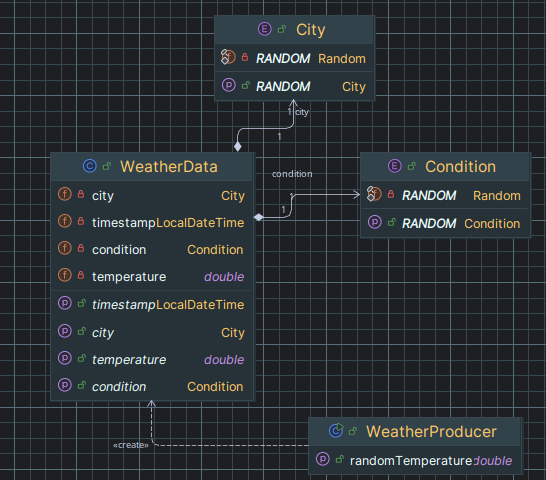
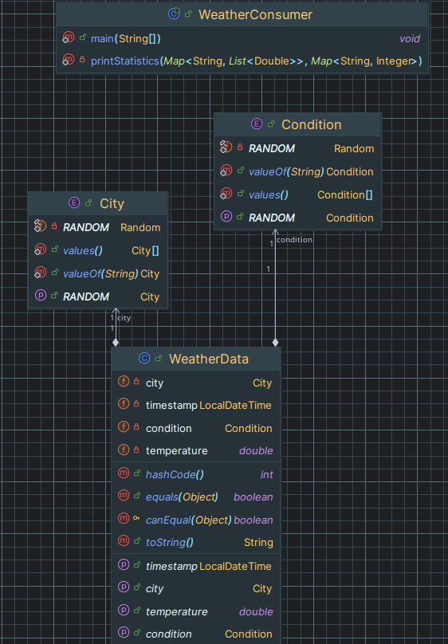

# MeteoKafkaMonitor

Учебный проект (Домашнее задание №1) для мониторинга погодных данных в реальном времени с использованием **Apache Kafka**

Приложение состоит из:
- `Producer` -- генератор погодных данных, отправляющий их на топик
- `Consumer` -- обработчик и агрегатор статистики

## Producer

Producer — это генератор случайных погодных данных, который:
- Эмулирует работу метеостанций в разных городах
- Отправляет данные в Kafka в реальном времени
- Поддерживает различные погодные условия и диапазоны температур

### Диаграмма:



### Формат сообщений:
*json*
``` json
{
  "city": "Magadan",
  "timestamp": "2023-07-18T14:30:45.123",
  "temperature": 12.5,
  "condition": "RAIN"
}
```

### Логика работы:
1. Создает объект `WeatherData` со случайными значениями
2. Сериализует в JSON с помощью Jackson
3. Отправляет в топик Kafka с ключом-городом:

## Consumer
Consumer — это аналитический модуль, который:
- Читает поток данных из Kafka
- Собирает статистику по городам

### Диаграмма


### Формат получаемых сообщений:
```
Received weather update:
City: TYUMEN
Time: 2025-07-14T12:38:46.401782240
Temp: 12.0°C
Condition: CLOUDY
Partition: 2
Offset: 515
```

### Формат обновляемой статистики:
```
=== Current Statistics ===
MAGADAN: Avg temp 9.7°C (232 samples)
TYUMEN: Avg temp 9.1°C (268 samples)
ST_PETERSBURG: Avg temp 8.5°C (255 samples)
SOCHI: Avg temp 9.8°C (239 samples)
MOSCOW: Avg temp 9.4°C (264 samples)
SNOWY: 337 times
RAINY: 272 times
CLOUDY: 347 times
SUNNY: 302 times
```

### Собираемая статистика
- Средняя температура по городам
- Количество солнечных, снежных, дождливых и облачных дней
- Количество поступившей информации по городам

## Технологии
- Apache Kafka 3.7 – потоковая передача данных
- Java 17 + Lombok – ядро приложения
- Jackson – сериализация JSON
- Gradle – сборка

***

*Выполнено в рамках лучшего учебного ИТ-лагеря от Т1*

*Автор: Давлетов Тимур*
